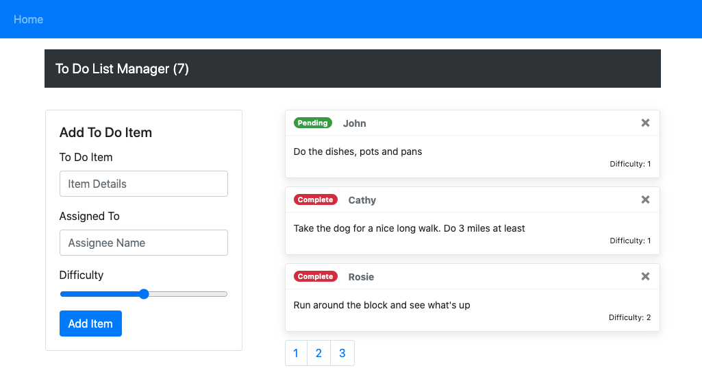

# LAB - Context API

**To Do List Manager Phase 1:** Incorporate configuration settings to the application

In this phase, we'll be adding some top-level settings for the application, so that the user can make some display choices that the app will use by default.

## Before you begin

Refer to *Getting Started*  in the [lab submission instructions](../../../reference/submission-instructions/labs/README.md) for complete setup, configuration, deployment, and submission instructions.

1. Create a new GitHub Repository named `todo-app`
1. Clone this to your machine
1. Copy the contents of the `starter-code` folder from the class repository for today

> Create and work in a new branch for today called 'context-settings'

## Business Requirements

Refer to the [To Do System Overview](../../apps-and-libraries/todo/README.md) for a complete review of the application, including Business and Technical requirements along with the development roadmap.

## Phase 1 Requirements

In Phase 1, we're going to perform some refactoring of the To Do application as built by another team. This application mixes application state and user settings at the top level and passes things around. It was a good proof of concept, but we need to make this production ready.

- Style the application using the [Blueprint Component API](https://blueprintjs.com/docs/#blueprint){target:_blank}

- Properly modularize the application into separate components

- Implement the Context API to make some basic application settings available to components
  - How many To Do Items to show at once
  - Whether or not to show completed items

## Technical Requirements / Notes

Based on global configuration

- Show a maximum of a certain number of items per screen in the `<List />` component
  - Provide "next" and "previous" links to let the users navigate a long list of items
- Hide or show completed items in the list
- Optional: Sort the items based on any of the keys (i.e. difficulty)

Implement this using `context`

- Create a `context` for managing application display settings and provide this at the application level
  - Display or Hide completed items (boolean)
  - Number of items to display per screen (number)
  - Default sort field (string)
  - Manually set (hard code) those state settings in the context provider's state, they should not be changeable

Pagination Notes:

- Only display the first `n` items in the list, where `n` is the number to display per screen in your context.
  - If you have more than `n` items in the list, add a button labeled `Next` that will replace the list with the next `n` items in the list.
  - If you are past the first `n` items (i.e. on page 2 or higher), add a button labeled `Previous` that will replace the list with the previous `n` items in the list.

### Stretch Goals

- Convert all components from classes to functions
- In your Context, read the settings in from an object in Local Storage and use that as the initial state

### Testing

- Tests should assert all behavioral functionality
- Do a deep mount of the app, and set tests to make assertions on the child components that consume context from the Provider.
  - Can they see context?

### Documentation

- Describe how global state is consumed by the components
- Describe the operation of the hook: `useForm()`

### Assignment Submission Instructions

Refer to the the [Submitting React Apps Lab Submission Instructions](../../../reference/submission-instructions/labs/react-apps.md) for the complete lab submission process and expectations
