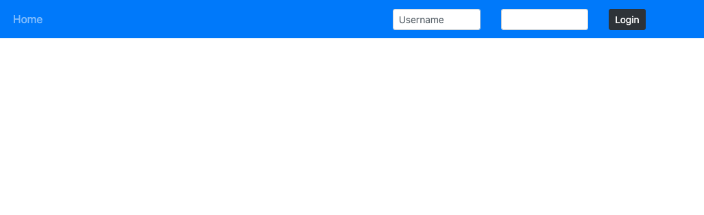
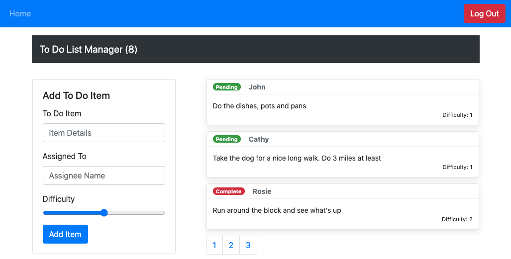

# LAB -  `<Login />`

**To Do List Manager Phase 3:** Adding security and access controls to the application.

In this final phase, we'll be requiring that users be logged in, in order to see the to do items. Additionally, based on their user type, they will be allowed (or denied) to perform actions such as editing or deleting them.

## Before you begin

Refer to *Getting Started*  in the [lab submission instructions](../../../reference/submission-instructions/labs/README.md) for complete setup, configuration, deployment, and submission instructions.

> Building off of your previous day's branch, create a new branch for today called 'auth' and continue to work in your 'todo' repository.

## Business Requirements

Refer to the [To Do System Overview](../../apps-and-libraries/todo/README.md) for a complete review of the application, including Business and Technical requirements along with the development roadmap.

## Phase 3 Requirements

In Phase 3, we'd like to extend the functionality of the application by requiring users be logged in to view items and also restrict access based on user type. The user stories from **Phases 1, and 2** remain unchanged. For this phase, we are now adding the following new user stories.

- As a user, I want to provide a way for all users to login to their account

Logged-Out User:

Logged-In User:

## Technical Requirements / Notes

Technical requirements for the core application are unchanged from the prior phases, with the following additions and notes:

- Provide an account login screen
  - Accepts Username and Password
  - On successful login, store the token as a cookie
- If a user returns and has a valid login cookie, bypass the login screen and consider them "Logged In"

### Tools you will need to complete the above requirements

#### Authentication Server

- You will need a deployed Authenticated API Server, which supports:
  - Registration (`/signup`)
  - Login (`/signin`)
  - Authorization (via Bearer Token)
  - ACL (using user roles)
    - Make sure you have created the user roles and permissions lists that your front-end is expecting to tap into
  - To Do data model for storing the actual to do items

#### Login/Auth Components and API

You have been provided, in the `demo` folder, a sample application built using the `<Login />`  component and context built during class. Get this running first, and analyze it. You will need these components to complete the Authentication tasks specified above

Once you have a working practice app, extract the Login Context and relevant components from it and incorporate them into your To Do application, implementing Authentication and Authorization as described in the requirements above

## Stretch Goal

Connect your To Do List to a live API Server

- You will need deployed API Server, which implements a todo item data model
  - `GET /todo`: Gets a list of all items
  - 'POST /todo': Adds an item
  - 'PUT /todo': Updates an item (you'll use this to mark them as complete)
  - 'DELETE /todo/:id' : Deletes an item

### Assignment Submission Instructions

Refer to the the [Submitting React Apps Lab Submission Instructions](../../../reference/submission-instructions/labs/react-apps.md) for the complete lab submission process and expectations

----
